[English Documentation](README.md) | [中文文档](README_CN.md)

# nextjs-saas-template
一个简单易使用、seo 友好的 next.js 模板，没有复杂的操作和配置，适合快速搭建一个落地页、saas 网站等。

模板仍在持续更新中...

## 预览
- `template-custom 黑白简约主题`

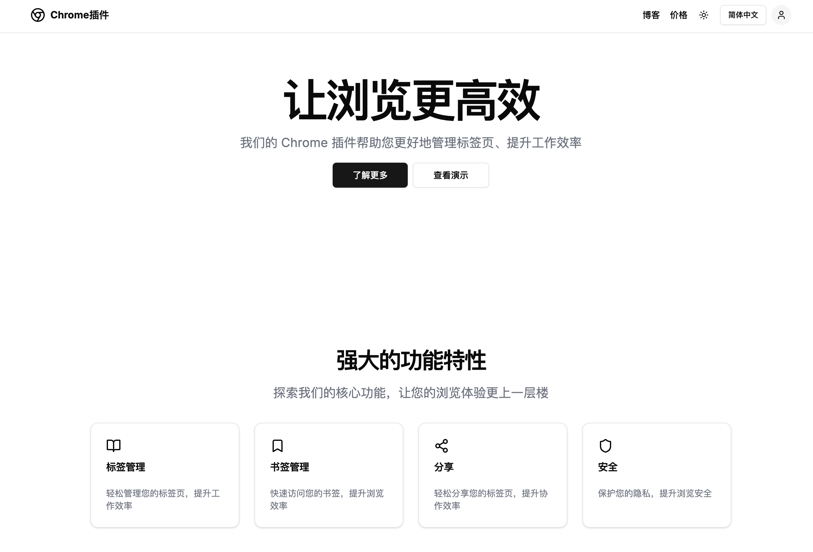

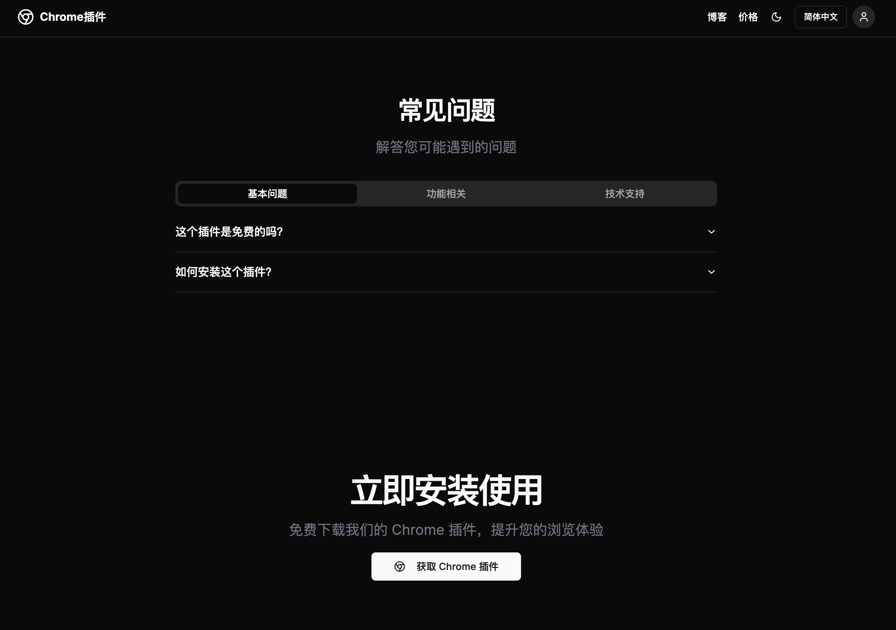

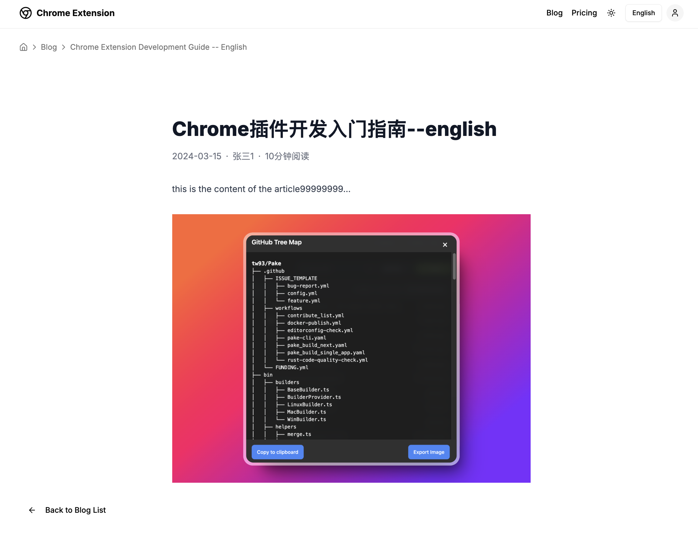

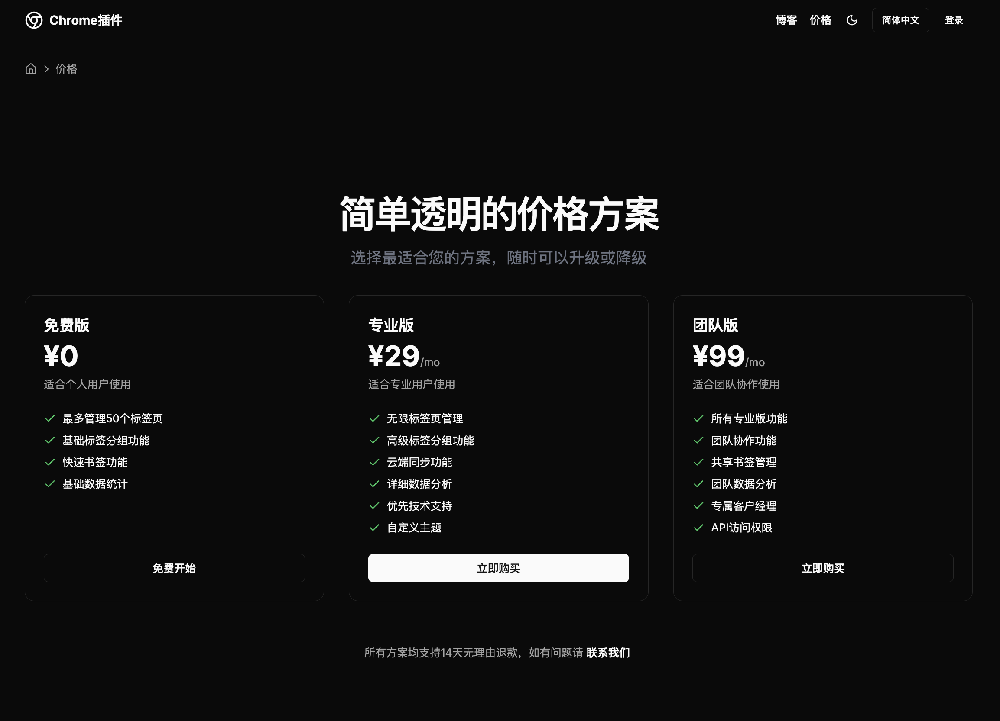

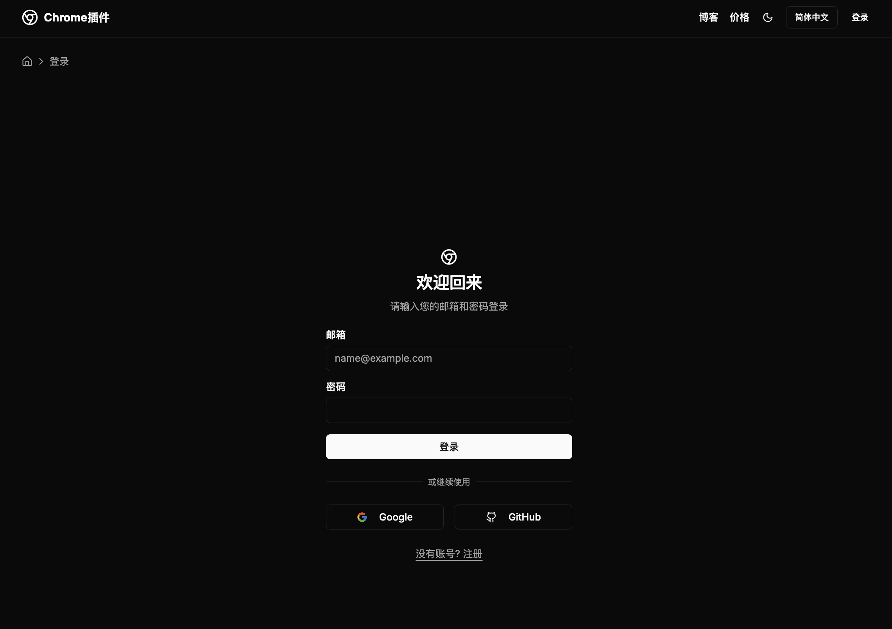

- `template-gradient 彩色渐变主题`

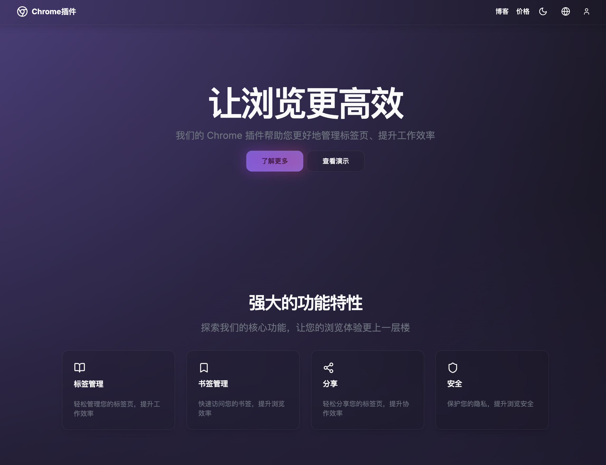

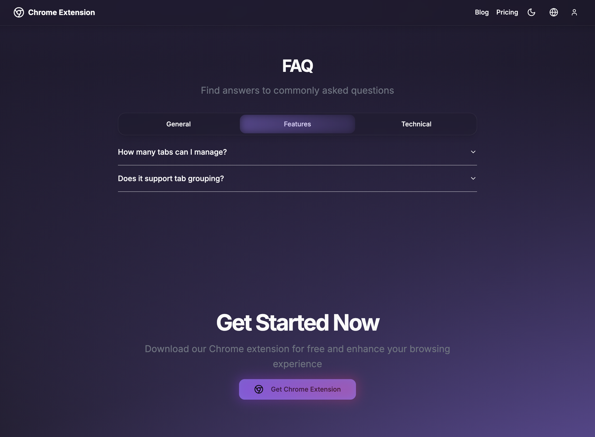

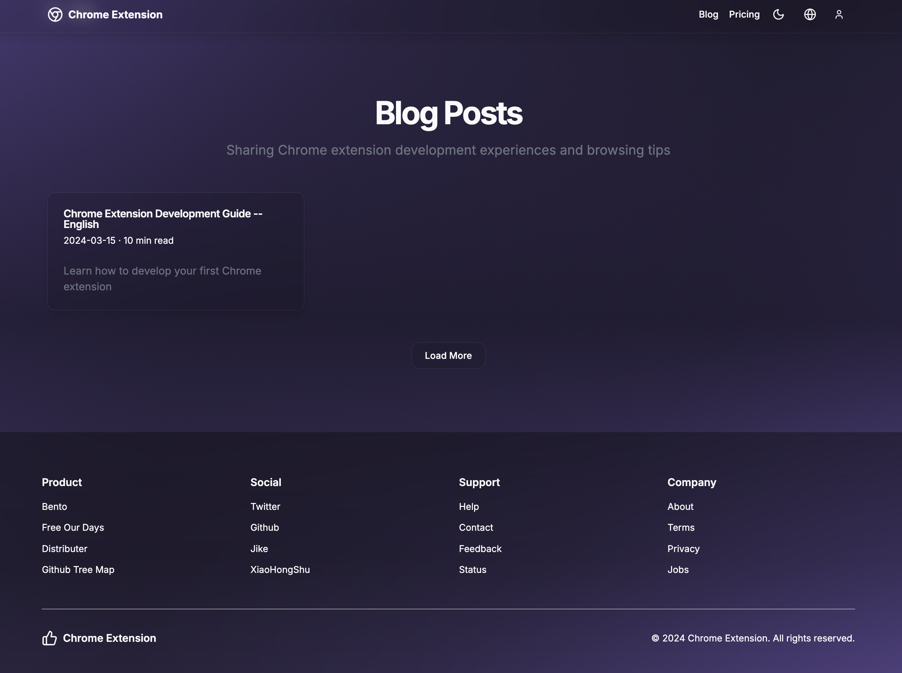

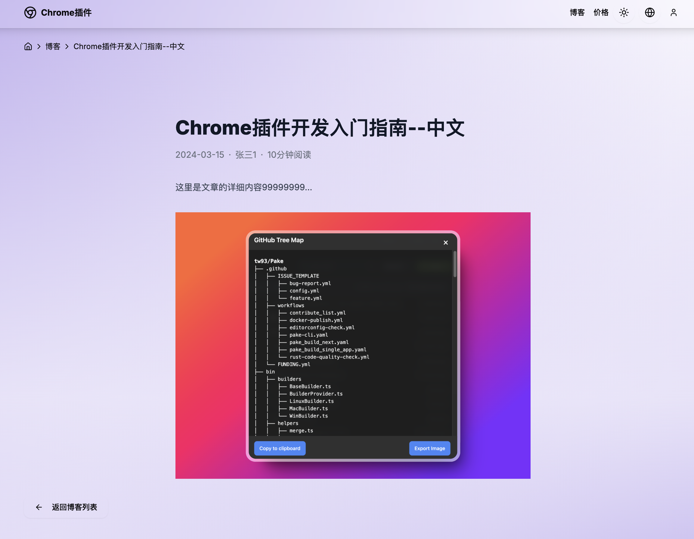

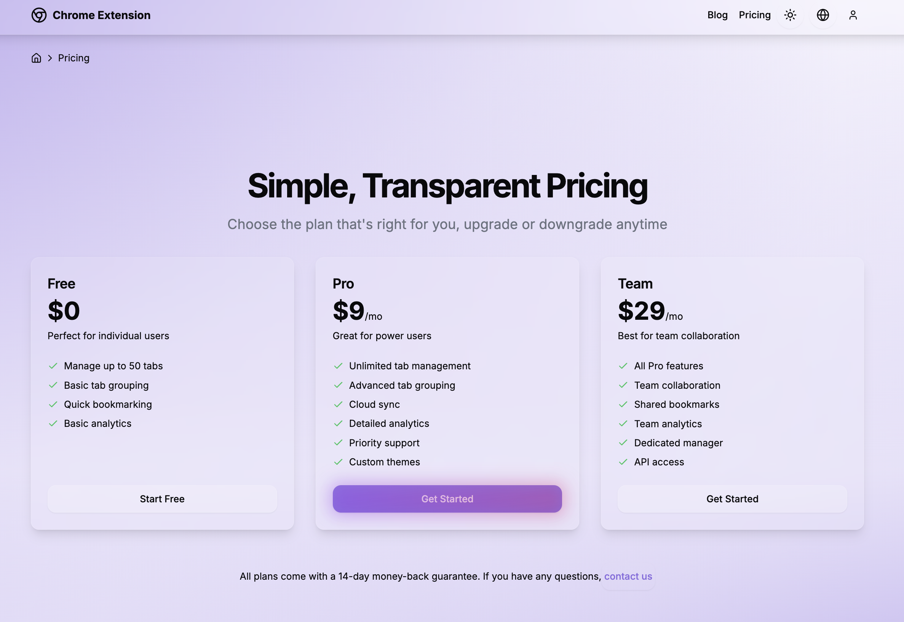

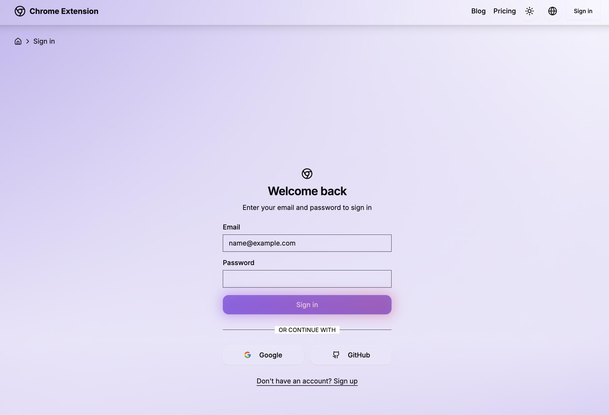

## 技术栈
- next.js 14
- shadcn/ui
- radix-ui
- tailwindcss
- lucide   
- i18next
  
## 功能
- 暗黑模式
- SEO 友好
- 多语言支持
- 博客
- 价格
- 登录/注册
- 个人中心

## 使用
- 克隆项目
  ```bash
  git clone git@github.com:jiweiyeah/nextjs-saas-template.git
  ```
- 安装依赖
  ```bash
  cd nextjs-saas-template/template-custom
  npm install

  cd nextjs-saas-template/template-gradient
  npm install
  ```
- 环境变量
  ```bash
  NEXT_PUBLIC_SUPABASE_URL=xxxxx
  NEXT_PUBLIC_SUPABASE_ANON_KEY=xxxxx
  NEXT_PUBLIC_APP_URL=xxxxx
  ```
- 运行项目
  ```bash
  cd nextjs-saas-template/template-custom
  npm run dev

  cd nextjs-saas-template/template-gradient
  npm run dev
  ```

## 部署
- [Vercel](https://vercel.com/docs)
- [Netlify](https://docs.netlify.com/frameworks/next-js/overview/)

## 联系
欢迎各位与我联系，提出宝贵意见！

邮箱: freeourdays@gmail.com

推特: https://x.com/freeourdays

微信: yeheboo

<table>
  <tr>
    <td></td>
    <td></td>
  </tr>
</table>